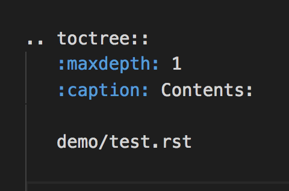

================
Sphinx快速入门
================

Sphinx是一个静态网页发布工具，可将rST和md文件，发布为各类常见的用户帮助如联机帮助，用户手册等。

安装Sphinx [*]_
=====================

Mac系统
----------------
    .. code-block:: python

        pip install Sphinx

Windows系统
------------------
#. 首先安装pip，可参考：
#. 运行如下代码
     .. code-block :: python

        pip install Sphinx

快速新建项目（以Mac系统为例，Window也是类似
======================================================
#. 在桌面上创建一个文件夹，并命名为`sphinx-demo`
#. 在Terminal中浏览至上述文件夹，并运行命令： sphinx-quickstart
#. 在对话框式的选择中，如果Y/N，则选Y，如果询问配置，直接复制[]中的内容，如[.rst]，则填写.rst
#. 新建成功后，则会得到如图所示的文件夹结构

.. image:: images/sphinx-dir.png

往项目中添加内容
============================
#. 浏览至 source 文件夹，并在其根目录下创建新文件夹demo
#. 在上方demo文件夹中，新建test.rst文件，并在其中输入如下内容：

:: 
    =======================
    这是Sphinx的测试
    =======================
    我爱学习Sphinx

#. 打开source文件中的 index.rst，将test.rst的文件添加至目录中，具体如下：

#. 在Terminal中运行编译命令

    .. code-block :: python 
        sphinx-build -b html source build

#. 编译成功的话，在build文件夹中则有刚才发布的网站

修改主题
===================
#. 打开 source中的conf.py，并找到主题配置行 html_theme = 'alabaster'
#. 从内置主题中挑选需要的主题，如Nature，将其改为 html_theme = 'bizstyle'
#. 重新运行发布命令后，则可得到新主题的

.. note::
    Sphinx内置主题的样式可见：http://www.sphinx-doc.org/en/master/theming.html#using-a-theme

安装ReadtheDoc同款主题
===========================

如果喜欢wwww.readthedoc.org的主题，可以按照如下方式安装

.. code-block:: python

    pip install sphinx_rtd_theme

安装之后，再按照上述步骤，修改为html_theme = 'sphinx_rtd_theme'，再重新发布即可。

参考资料

.. [*] http://www.sphinx-doc.org/en/master/usage/quickstart.html

